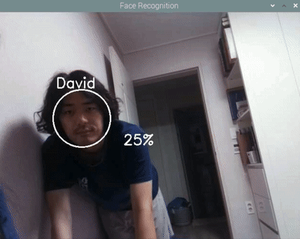
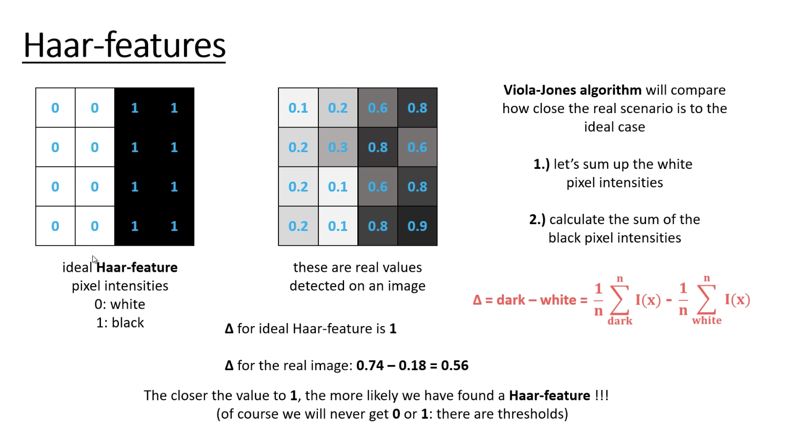
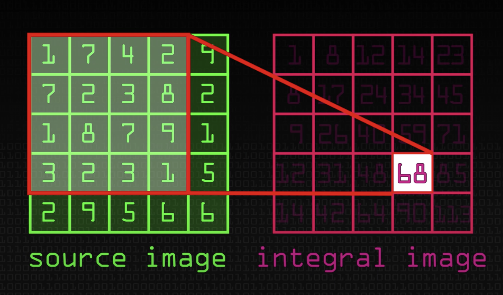
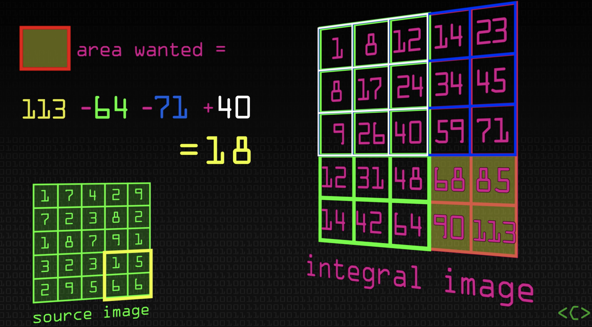

# Real-Time Face Recognition using Raspberry Pi, OpenCV, Python - Implementing Haar Cascades classifier and LBPH
 [3]

## Haar Features
 [1]

 [2]

- They detect edge, line, center-surrounded, special diagonal line features

## Integral Image
 [3]
 [4]

- Integral Image is created by calculating the sum of values (pixel values) in a given image.
- As you can see in Image[4], creating an integral image can make it very efficient and fast to extract wanted values of a certain region.

## Haar Cascades Classifier
 [5]

- It is a classifier in which the Cascade function is trained by superimposing the positive image over a set of negative images.
- It uses Haar Features and Integral Images.
- It helps in the stages of Face Detection and Feature Extraction.

## Local Binary Patterns Histograms Face Recognizer (LBPH)
 [6]

- It works by looking at every single point of the image.
  - It compares central value of the selected region (pixel value) with its neighboring values.
  - If a neighboring value is lower than the central pixel, the neighboring value is going to be written as zero.
  - If a neighboring value is greater than the central pixel, the neighboring value is going to be written as one.
  - Thus, it makes a binary pattern out of each individual pixel. (Hence, the name of the "Local Binary Patterns Histogram.")
  - Then, it concatenates each binary value from each position from the matrix (line by line or clockwise) into a new binary value (e.g. 10011010).
  - This binary value is converted to a decimal value.
  - The new decimal value is then set to be the central value of the matrix.
  - All the decimal values created get plotted on a histogram. (Say, there were total 9 3x3 pixel regions from an image, it will create 9 histograms.)
 
 [7]
- All the histograms of each region created get concatenated.
- The final histogram represents better than the characterisitics of the original image.

## Why LBPH works better than other face detection algorithms?

- Eigenfaces and Fisherfaces are affacted by light as they try to look at the facial image as a whole.
- LBPH, however, looks at every single value of the image and comapres each value to its neighboring pixels.
- This way, LBPH finds the local structure of the image, which allows it to better identify the face in different lighting conditions than Eignefaces/ Fisherfaces.

## Additional Notes
### Eigenfaces
- It uses Principal Component Analysis.
- It is an appearance-based apporach which captures the variation in a collection of face images.
- It then uses this data to compare different face images in a holistic manner.

### Fisherfaces
- It is an enhancement of the Eigenface method.
- It uses Linear Discriminant Analysis for the dimensionality reduction.

## Reference
[1] "Computer Vision - Haar-Features". Global Software Support, 2018, https://youtu.be/F5rysk51txQ.

[2] "Opencv: Cascade Classifier". OpenCV, https://docs.opencv.org/3.4/db/d28/tutorial_cascade_classifier.html.

[3][4] "Detecting Faces (Viola Jones Algorithm) - Computerphile". Computerphile, 2018, https://youtu.be/uEJ71VlUmMQ.

[5] "What are Haar Features used in Face Detection ?". Darshan Adakane, 2019, https://medium.com/analytics-vidhya/what-is-haar-features-used-in-face-detection-a7e531c8332b.

[6][7] "Face Recognition: Understanding LBPH Algorithm". Kelvin Salton do Prado
. https://towardsdatascience.com/face-recognition-how-lbph-works-90ec258c3d6b
